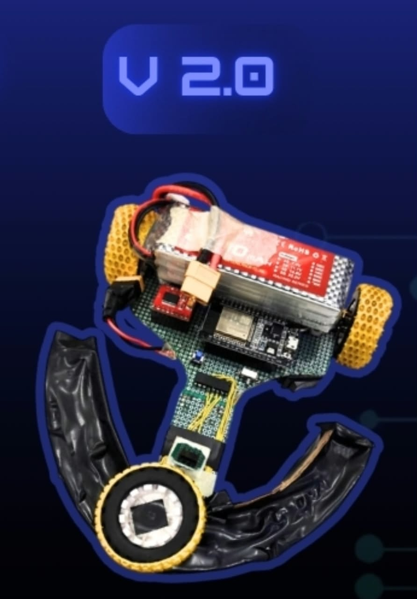

# High-Speed Line Follower V2

A speed-focused line follower built around an **ESP32**, **1000 RPM N20 motors**, **TB6612FNG**, and a **16-channel IR sensing system**.

The goal of V2 was simple: **go faster while maintaining precise control.**

---

## Features

- ESP32-based control
- 15 front IR sensors + 1 rear-centering IR sensor
- 16-channel analog sensor acquisition
- Dual 8-channel multiplexing
- Automatic per-sensor calibration
- Normalized analog sensor readings
- Weighted line-position calculation
- PD control
- Dynamic speed control based on line error
- 1000 RPM N20 motors
- TB6612FNG motor driver
- Bluetooth tuning framework
- Line-loss detection and recovery

---

## Hardware

| Component | Details |
|---|---|
| Controller | ESP32 |
| Sensors | 15 Front IR + 1 Rear IR |
| Motor Driver | TB6612FNG |
| Motors | 1000 RPM N20 |
| Sensor Interface | 2 × 8-channel multiplexers |
| Drive | Differential |

---

## Control System

The robot uses calibrated analog sensor readings to estimate the position of the line.

```text
16 IR Sensors
      ↓
Analog Reading
      ↓
Per-Sensor Calibration
      ↓
Normalized Values
      ↓
Weighted Error
      ↓
PD Controller
      ↓
Dynamic Speed Control
      ↓
Motor Correction

```

## Media

### Robot



### Demo

[Watch the Line Follower V2 Demo](media/flf_video.mp4)

---

### Controller

The current control parameters are:

```cpp
kp = 50;
kd = 70;
ki = 0;
```

Since `ki = 0`, the active controller is effectively **PD control**.

---

## Dynamic Speed Control

V2 does not simply run at one fixed speed.

The base speed is dynamically adjusted according to the magnitude of the line error.

```text
Small Error  → Higher Speed
Large Error  → Lower Speed
```

This allows the robot to maintain higher speeds on straights while reducing speed when larger corrections are required.

The active speed range is approximately:

```text
Minimum Speed = 60
Maximum/Base Speed = 150
```

The speed is calculated dynamically using the current line error.

```cpp
base_speed = min_speed +
             (const_speed - min_speed) *
             exp(-0.15 * abs(error));
```

---

## Sensor Calibration

At startup, the robot automatically rotates in both directions and records the minimum and maximum value of every sensor.

This creates an individual calibration range for each sensor.

Each sensor reading is then normalized:

```cpp
norm = (sensor[i] - sensorMin[i]) /
       (sensorMax[i] - sensorMin[i]);
```

The normalized value is constrained between `0` and `1` before being used for line-position calculation.

This compensates for differences between individual IR sensors and provides more consistent line detection.

---

## Line Position Estimation

Each of the 16 sensors is assigned a positional weight.

```cpp
float weights[16] = {
    -8, -6, -4.5, -3.5,
    -3, -2, -1.5, 0,
     0,  1.5, 2, 3,
     3.5, 4.5, 6, 8
};
```

The normalized sensor readings are combined using these weights to calculate the position of the line relative to the robot.

The resulting value becomes the error input for the PD controller.

---

## Line Loss Recovery

If the combined sensor response falls below a defined threshold, the robot considers the line lost.

```cpp
if (total < 2)
{
    lineLost = true;
    return (previous_error > 0) ? 12 : -12;
}
```

The previous error determines which direction the robot should continue correcting toward.

This allows the robot to recover from temporary line loss instead of immediately stopping.

---

## Sensor Architecture

The 16 sensor channels are read using two 8-channel analog multiplexer outputs.

```text
                 ESP32
                   │
            ┌──────┴──────┐
            │             │
           Z1            Z2
            │             │
      8 IR Channels   8 IR Channels
            │             │
            └──────┬──────┘
                   │
            16 Sensor Array
```

### Multiplexer Selection

```text
S0 → GPIO 25
S1 → GPIO 26
S2 → GPIO 27
```

### Analog Inputs

```text
Z1 → GPIO 34
Z2 → GPIO 35
```

---

## Motor Control

The robot uses a **TB6612FNG** motor driver with differential drive.

### Motor Pins

```text
AIN1 → GPIO 18
AIN2 → GPIO 19
PWMA → GPIO 23

BIN1 → GPIO 16
BIN2 → GPIO 17
PWMB → GPIO 5

STBY → GPIO 4
```

The motor control system supports forward and reverse commands, allowing aggressive corrections when required.

---

## Startup Sequence

When powered on, the robot:

```text
Power On
   ↓
Initialize ESP32
   ↓
Initialize Motor Driver
   ↓
Initialize Sensor System
   ↓
Rotate Left
   ↓
Collect Sensor Min/Max
   ↓
Rotate Right
   ↓
Collect Sensor Min/Max
   ↓
Stop
   ↓
Wait for Start Switch
   ↓
Begin Line Following
```

The calibration routine rotates the robot for approximately **3.5 seconds in each direction** while collecting sensor data.

---

## Bluetooth Tuning

The code includes a Bluetooth tuning framework using the ESP32's Bluetooth Serial interface.

The robot advertises itself as:

```text
LineFollower
```

Supported tuning commands in the code include:

```text
KP=...
KD=...
KI=...
SPEED=...
```

This provides a framework for experimenting with controller parameters without changing the source code.

---

## V1 → V2

| Feature | V1 | V2 |
|---|---|---|
| Controller | Arduino Nano | ESP32 |
| Front Sensors | 7 IR | 15 IR |
| Additional Sensor | Obstacle Detection | Rear-Centering IR |
| Motors | N20 | 1000 RPM N20 |
| Sensing | Digital | Analog + Calibrated |
| Sensor Resolution | Lower | 16 Channels |
| Speed Control | Fixed | Dynamic |
| Control | PD | PD |
| Main Focus | Reliability | **Speed** |

---

## Repository Structure

```text
High-Speed-Line-Follower-V2/
│
├── README.md
│
├── Code/
│   └── line_follower_v2.ino
│
└── media/
    ├── bot_photo.jpg
    ├── team_photo.jpg
    └── line_follower_v2.mp4
```

---

## Project Status

**Completed Prototype**

V2 was developed as a high-speed evolution of the previous line follower, increasing sensor resolution, motor speed, calibration accuracy, and control responsiveness.

The main objective was not simply to make the robot faster, but to make it **controllable at higher speeds**.

---

## Author

**Devanshi Maleri**

Robotics | Embedded Systems | Electronics | Control Systems

---

## License

For educational and portfolio purposes.

Attribution is appreciated if the project is reused or modified.
